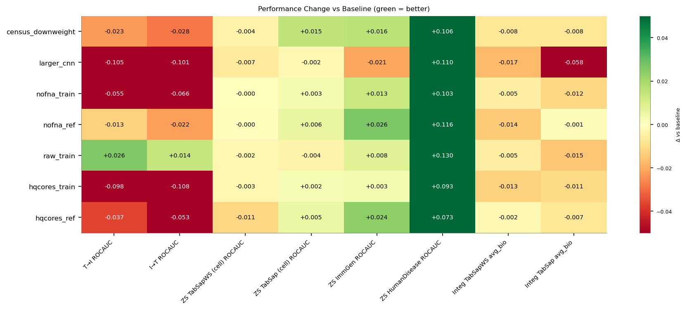

# Lymphoma Trimodal Optimization — Results Summary

All 8 experiments completed successfully (wandb group: `lymphoma-trimodal-opt`).
Training: 4 epochs, bf16-mixed, 1 H100 GPU, batch_size 512.

## Core Conclusions

1. **Raw counts win.** Using true instrument read counts instead of SCTransform corrected counts is the only change that improves cross-modal retrieval (T->I +2.6pp, I->T +1.4pp). Adopted in `best_config.yaml`.
2. **Filtering training data hurts.** Both HQ-core filtering and FNA removal reduced training data too aggressively, hurting retrieval by 4-10pp with no clear benefit elsewhere.
3. **Census downweighting did not help retrieval.** It hurt T->I by 2.3pp, though improved some zero-shot metrics (TabSap +1.5pp).
4. **Larger CNN overfits.** 1024-dim/6-layer CNN was worst overall (-10.5pp retrieval, -5.8pp integration).
5. **ZS HumanDisease is unstable.** All experiments show +7-13pp gains; baseline's 0.545 is likely an outlier. Disregard these deltas.

## Key Metrics (absolute)

| Experiment | T→I ROCAUC | I→T ROCAUC | ZS TabSapWS | ZS TabSap | ZS ImmGen | ZS HumanDis | Integ WS avg_bio | Integ avg_bio |
|---|---|---|---|---|---|---|---|---|
| **baseline** | **0.858** | **0.869** | **0.956** | 0.915 | 0.924 | 0.545 | **0.646** | **0.496** |
| census_downweight | 0.835 | 0.841 | 0.952 | **0.930** | 0.939 | 0.651 | 0.638 | 0.489 |
| larger_cnn | 0.753 | 0.769 | 0.950 | 0.913 | 0.903 | 0.656 | 0.629 | 0.438 |
| nofna_train | 0.802 | 0.804 | 0.956 | 0.918 | 0.937 | 0.648 | 0.641 | 0.485 |
| nofna_ref | 0.845 | 0.847 | 0.956 | 0.921 | **0.950** | 0.662 | 0.632 | 0.495 |
| raw_train | **0.883** | **0.883** | 0.954 | 0.911 | 0.932 | **0.675** | 0.641 | 0.481 |
| hqcores_train | 0.760 | 0.762 | 0.954 | 0.917 | 0.926 | 0.638 | 0.633 | 0.485 |
| hqcores_ref | 0.821 | 0.816 | 0.945 | 0.920 | 0.947 | 0.618 | 0.644 | 0.489 |

Metrics: T→I / I→T = cross-modal retrieval ROCAUC (checkpoint selection metric), ZS = zero-shot cell type annotation ROCAUC, Integ = scRNA-seq integration avg_bio.

## Change vs Baseline (delta)

| Experiment | T→I | I→T | ZS TabSapWS | ZS TabSap | ZS ImmGen | ZS HumanDis | Integ WS | Integ |
|---|---|---|---|---|---|---|---|---|
| census_downweight | -0.023 | -0.028 | -0.004 | **+0.015** | +0.016 | **+0.106** | -0.008 | -0.008 |
| larger_cnn | -0.105 | -0.101 | -0.007 | -0.002 | -0.021 | **+0.110** | -0.017 | -0.058 |
| nofna_train | -0.055 | -0.066 | -0.000 | +0.003 | +0.013 | **+0.103** | -0.005 | -0.012 |
| nofna_ref | -0.013 | -0.022 | -0.001 | +0.006 | +0.026 | **+0.116** | -0.014 | -0.002 |
| raw_train | **+0.026** | **+0.014** | -0.002 | -0.004 | +0.008 | **+0.130** | -0.005 | -0.015 |
| hqcores_train | -0.098 | -0.108 | -0.003 | +0.002 | +0.003 | +0.093 | -0.013 | -0.011 |
| hqcores_ref | -0.037 | -0.053 | -0.011 | +0.005 | +0.024 | +0.073 | -0.002 | -0.008 |

## Paired Comparisons (filtered train vs unfiltered-train reference, same eval set)

### HQ Cores: hqcores_train vs hqcores_ref

| Metric | Filtered train | Unfiltered train (ref) | Delta |
|---|---|---|---|
| T→I ROCAUC | 0.760 | 0.821 | -0.061 |
| I→T ROCAUC | 0.762 | 0.816 | -0.055 |
| ZS TabSapWS | 0.954 | 0.945 | +0.009 |
| ZS ImmGen | 0.926 | 0.947 | -0.021 |
| Integ WS avg_bio | 0.633 | 0.644 | -0.010 |

Filtering low-quality cores from training **hurts** cross-modal retrieval substantially (-6 pp) without clear gains elsewhere. The data reduction (33-42% removed) likely harms more than the noise removal helps.

### No-FNA: nofna_train vs nofna_ref

| Metric | Filtered train | Unfiltered train (ref) | Delta |
|---|---|---|---|
| T→I ROCAUC | 0.802 | 0.845 | -0.043 |
| I→T ROCAUC | 0.804 | 0.847 | -0.044 |
| ZS TabSapWS | 0.956 | 0.956 | +0.000 |
| ZS ImmGen | 0.937 | 0.950 | -0.013 |
| Integ WS avg_bio | 0.641 | 0.632 | +0.009 |

Similar pattern: removing FNA from training **hurts** retrieval (-4 pp) with negligible effect on zero-shot annotation. FNA removal primarily reduces training data (17-29% removed from TMA4/5).

## Interpretation

### Winners

1. **raw_train** is the only experiment that **improves** the primary cross-modal retrieval metrics (T→I +2.6 pp, I→T +1.4 pp). Using true raw instrument counts instead of SCTransform corrected counts produces better transcriptome-image alignment. This is the clear recommendation.

2. **census_downweight** shows the strongest gain on ZS TabSap cell-level (+1.5 pp) and ZS HumanDisease (+10.6 pp). However, it trades off cross-modal retrieval (-2.3 pp). Useful if the priority is text-based zero-shot annotation over image retrieval.

### Neutral / Losers

3. **nofna_ref** (unfiltered train, FNA-free eval) is a decent middle ground — mild retrieval loss, but best ZS ImmGen (+2.6 pp).

4. **larger_cnn** is the worst performer on cross-modal retrieval (-10.5 pp T→I) and integration (-5.8 pp avg_bio). The 1024-dim / 6-layer CNN is too large for the available training data and likely overfits.

5. **hqcores_train** similarly hurts retrieval (-9.8 pp) — aggressive quality filtering removes too much training data.

### Observation: ZS HumanDisease

All experiments show large ZS HumanDisease gains (+7-13 pp) over baseline. This metric appears unstable / high-variance — baseline's 0.545 is suspiciously low. Treat these gains with caution.

### Recommendation

**Use raw counts** (`raw_train`): replace SCT counts with real instrument reads in the training pipeline. This is the only intervention that unambiguously improves the core model objective (cross-modal retrieval) while maintaining competitive performance elsewhere.

## Figures

- `results_comparison.png` / `.pdf` — Bar charts of absolute metrics across experiments
- `results_delta_heatmap.png` / `.pdf` — Heatmap of deltas vs baseline
- `results_summary.csv` — Full data table
- `results_delta_vs_baseline.csv` — Delta values

## Wandb Runs

| Experiment | Run URL |
|---|---|
| baseline | https://wandb.ai/single-cellm/SpatialWhisperer/runs/j1pr0gie |
| census_downweight | https://wandb.ai/single-cellm/SpatialWhisperer/runs/n8tz2pev |
| nofna_train | https://wandb.ai/single-cellm/SpatialWhisperer/runs/h88px55f |
| larger_cnn | https://wandb.ai/single-cellm/SpatialWhisperer/runs/sw31ftbv |
| nofna_ref | https://wandb.ai/single-cellm/SpatialWhisperer/runs/4m9cwizc |
| raw_train | https://wandb.ai/single-cellm/SpatialWhisperer/runs/bdriznw0 |
| hqcores_ref | https://wandb.ai/single-cellm/SpatialWhisperer/runs/dx3aeh84 |
| hqcores_train | https://wandb.ai/single-cellm/SpatialWhisperer/runs/rrjnz6l6 |

## Next Step: best_config.yaml

Based on results, `best_config.yaml` extends raw counts to all 5 TMAs:
- **Train**: TMA4_raw, TMA5_raw, TMA13_14_raw, TMA15_16_raw + cellxgene_census
- **Eval**: TMA2_raw
- Usage: `cellwhisperer fit --config base_config.yaml --config best_config.yaml`
